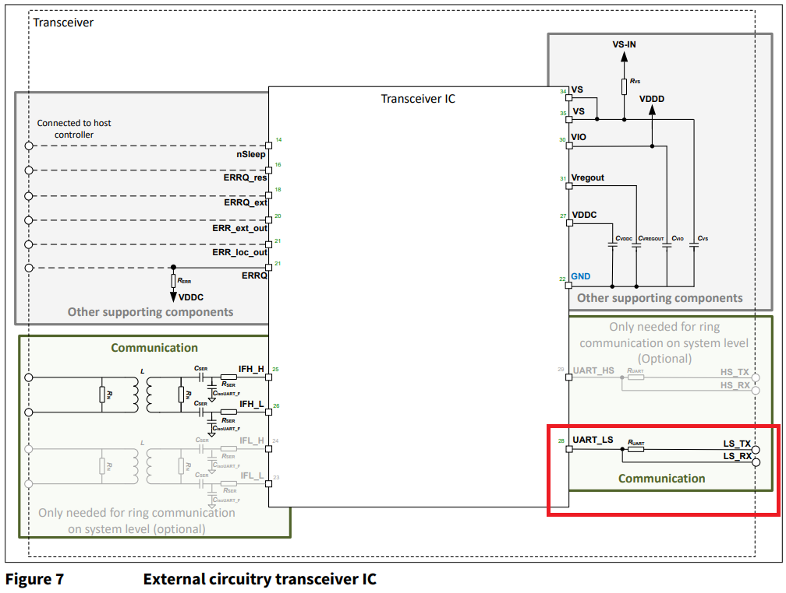

# An Arduino Library for the Infineon TLE9012 Battery Management IC

This Library aims to be an easy to use solution to experiment with the TLE9012 BMS IC from Infineon. There are a couple examples included in the examples folder to get you started using the basic functions of the library. More complex examples are planed to be added in the future. Examples are written for a ESP32 Node MCU but can be adapted to other boards by passing an appropriate HardwareSerial instance to the tle9012.init() function. If RX and TX pins are fixed for the architecture just pass 0 for the rxpin and txpin arguments. 

# Hardware Setup

In a typical high voltage BMS multiple frontend ICs like the TLE9012 are connected in a daisy chain to monitor cell voltages and temperatures and perform cell balancing. The physical connection between TLE9012s is achieved by connecting them in a daisy chain using a proprietary isoUART Interface. This Interface allows for a galvanically isolated connection which is necessary because potential differences between devices can reach up to a few hundred volts. 

Because there is no microcontroller featuring a native isoUART interface as a peripheral, it is necessary to either use a Transceiver IC like the TLE9015 or connect the microcontroller to the dedicated UART interface of the TLE9012 which is identical to the interface of the TLE9015. Both chips feature a UART_LS and a UART_HS Pin. While it might be tempting to think about these pins as RX and TX, each pin works as RX *and* TX pin. LS and HS stand for Low and High Side and the decision what pin to use depends on the position in the daisy chain. If a TLE9012 is woken using the LS pin, it will forward the wakeup on its high side isoUART interface. If its woken using the HS interface, the wakeup will be forwarded in the lowside isoUART.

To use these half-duplex pins with a regular isoUART peripheral, it is necessary to connect the rx and tx pins via a series resistor as shown in the following figure from the TLE9015 datasheet. The same principal applies if using the TLE9012. A typical value for this series resistor is 1k to 1k5 Ohm. 

If this library should be used with the official [TLE9012DQU Evaluation Board](https://www.infineon.com/cms/en/product/evaluation-boards/tle9012dqu_dtr_bms2/) without the TLE9015 a few simple modifications have to be made. First desolder the resistor R56 connection VIO with the output of the onboard linear regulator of the TLE9012. The supply for the IO Pins now needs to be supplied through the VIO testpin but this allows to choose either 3V3 or 5V as IO voltage depending on the choosen Arduino Board. In addition R35 or R37 needs to be replaced by 0 Ohm resistors. Now the combined (through an external 1k5 resistor) TX and RX node from the Arduino can be connected Pin 5 or 6 of CON3 (Note that Pin 1 of CON3 is next to the IsoUART connector).

# Limitations

Due to the limited size of the Receive Buffer provided by the standard Serial library, it might be necessary to increase the size by editing the Serial.h files provided by your Arduino installation.

Multiread is not supported in current Versions of this librarys.

# Board Compatibility 

In theory this library is compatible with all Arduino Boards featuring two Serial Ports but there are a few things to consider:
- The officially supported Baudrate of the TLE9012/9015 is 2Mbit/s although 1Mbit/s should also work, but it is not offically supported so there might be some communication timeouts
- Below 1Mbit/s communication is *NOT* possible
- The Arduino Core for the target platform has to send out UART Frames without a significant delay between bytes. Otherwise a timeout in the isoUART Transceivers is triggered and messages are not received correctly by the TLE9012

Boards with only one Hardware Serial port might still work if the Serial terminal is not required for debugging.

Boards that are tested to work are:
- ESP32 Node MCU
- Uno R4 (only with 1Mbit Baudrate)

Not directly compatible:
- Arduino Uno prior to R4
- Atmega328 based Arduino Nanos

# Getting Started

Under construction. For the moment please see the examples shipped with the library

# Using more than 1 Board

To be able to use more than one Board with the Library it is possible to modify the N_DEVICES makro in the TLE9012.h file. If you plan on using a large number of boards with broadcast read commands, it might also be necessary to increase the SERIAL_RX_BUFFER_SIZE in the Serial Library of your Arduino Core.

# Important Links

Here are some useful links to documents around the TLE9012 and TLE9015 used to build this library

- [TLE9012 Datasheet](https://www.infineon.com/dgdl/Infineon-TLE9012DQU-DataSheet-v01_00-EN.pdf?fileId=8ac78c8c7e7124d1017f0c3d27c75737)
- [TLE9012 and 9015 User Manual](https://www.infineon.com/dgdl/Infineon-Infineon-TLE9012DQU_TLE9015DQU-UM-v01_00-EN-UserManual-v01_00-EN.pdf?fileId=8ac78c8c7e7124d1017f0c4f8750574b&da=t)
- [TLE9015 Datasheet](https://www.infineon.com/dgdl/Infineon-TLE9015DQU-DataSheet-v01_00-EN.pdf?fileId=8ac78c8c7e7124d1017f0c62000f6342)
